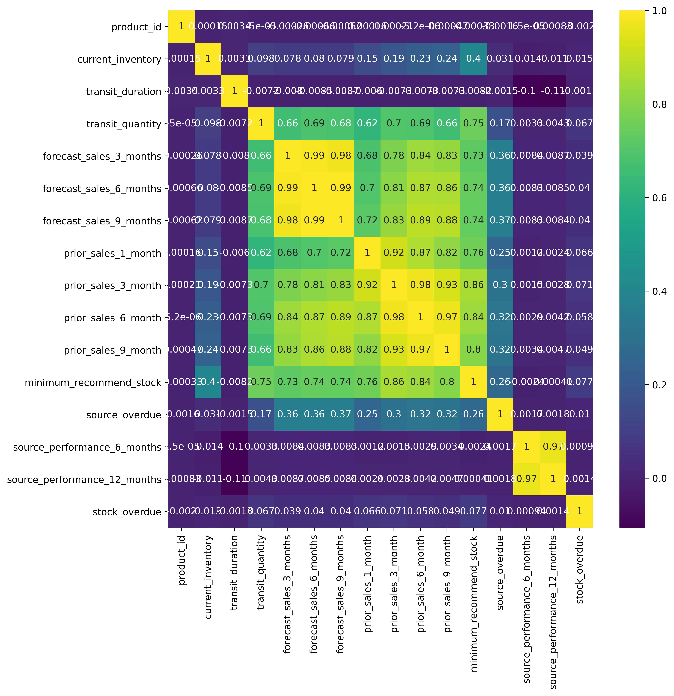

# Backorders_Supply_Chain_Analysis (Competition Dataset)
Analyzed the supply chain process-data and developed ML models using Python that can predict if a given order goes to back order with 89% precision and 46% recall in Random Forest model.

